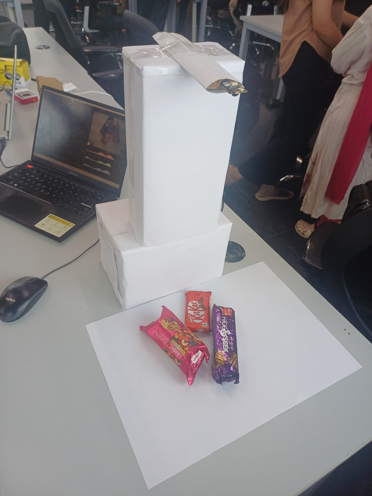
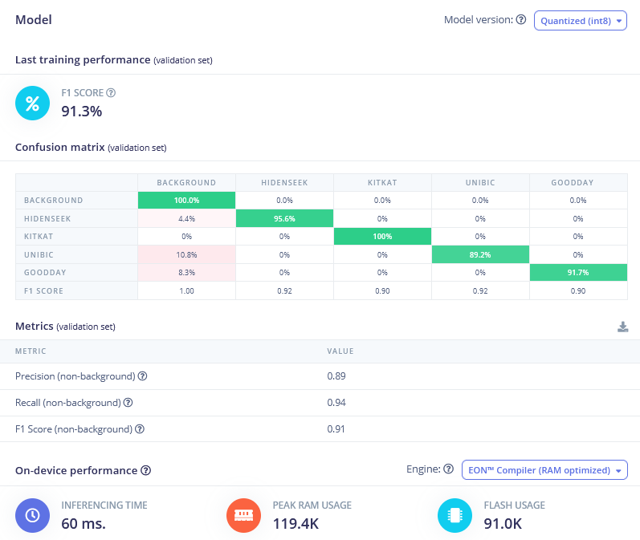
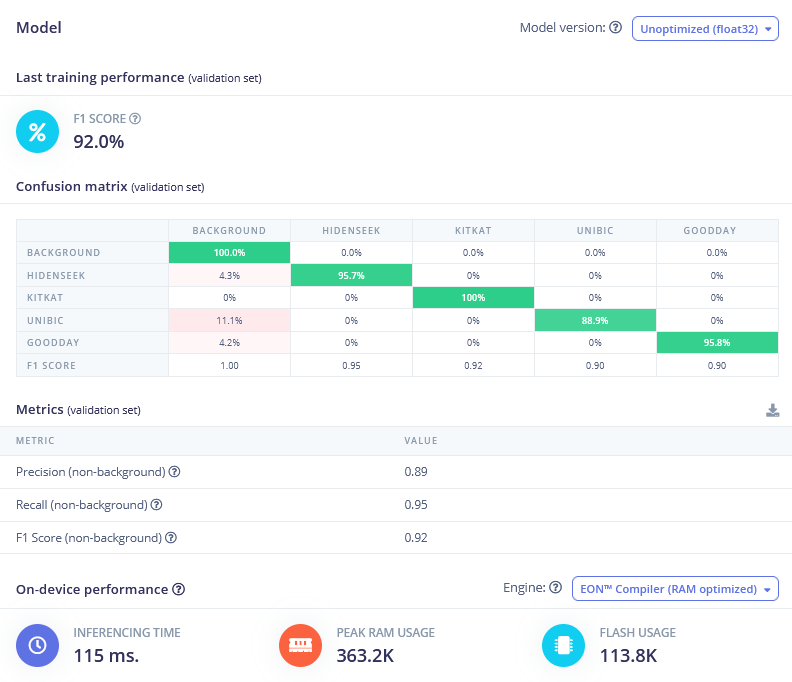
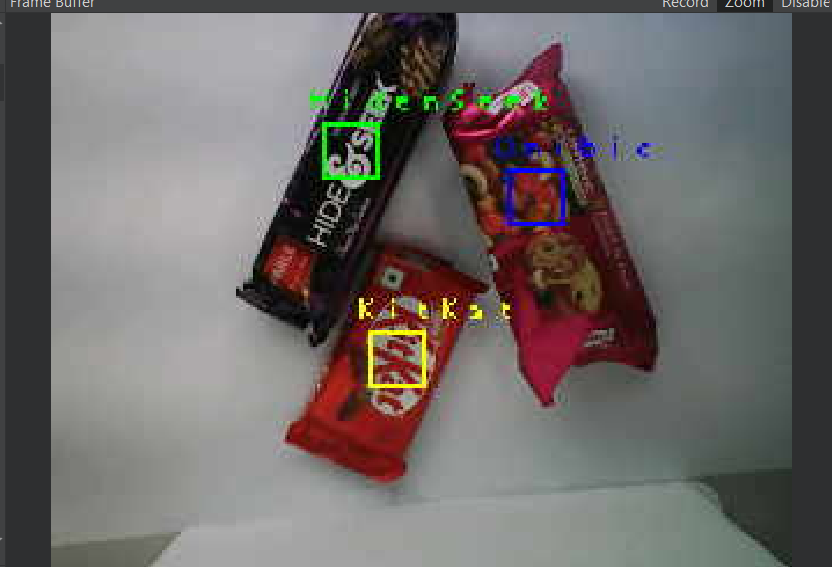
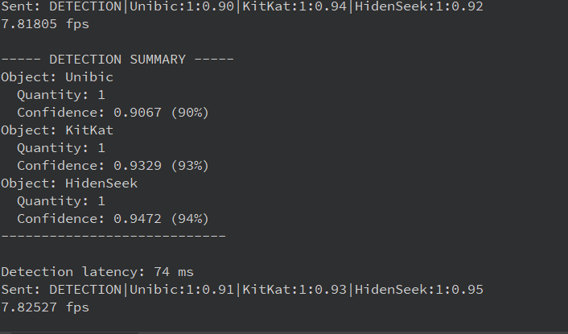
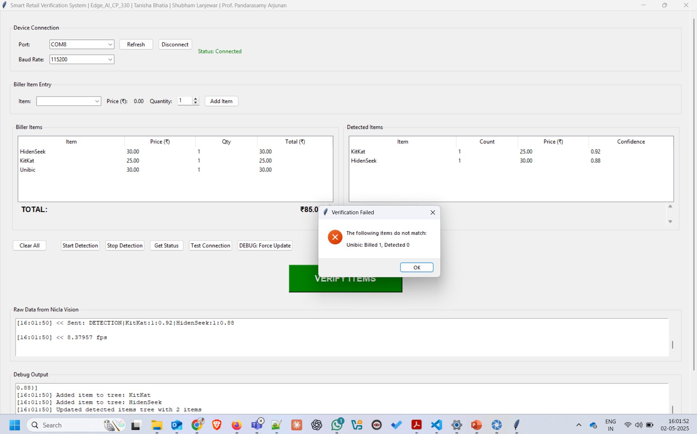
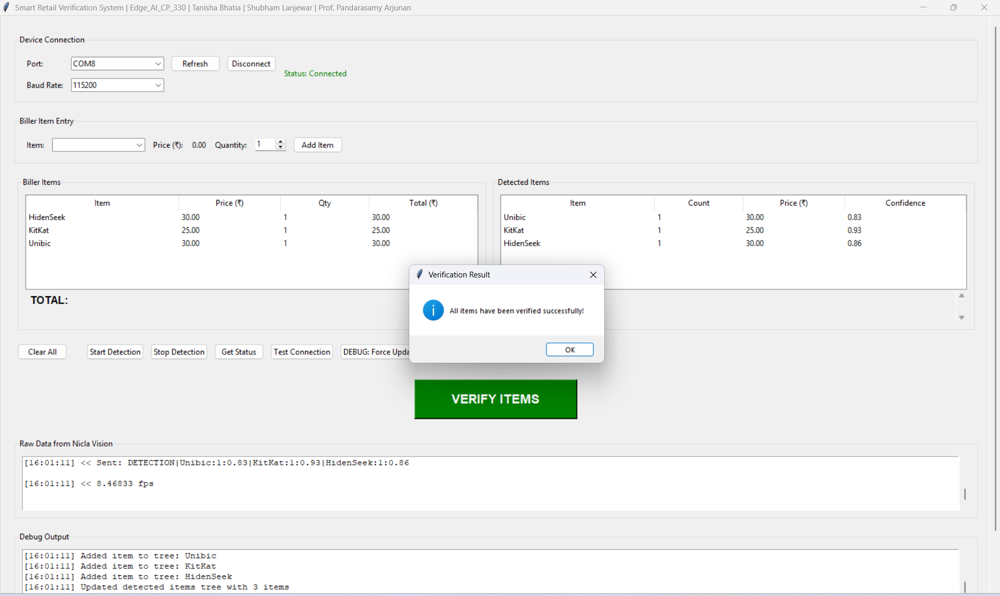

# Smart Retail Verification System


## Overview

The Smart Retail Verification system uses Edge AI to reduce errors at retail billing counters. The system employs a Nicla Vision device to detect retail items using a compact object detection model and communicates with a Python GUI application that verifies billed versus detected items.


## Setup

<table>
  <tr>
    <td align="center"></td>
  </tr>
  <tr>
    <td align="center">Experimental Setup for Smart Retail Verification System</td>
  </tr>
  <tr>
    <td>
      <ul>
        <li>Nicla Vision mounted 45cm above detection area</li>
        <li>Items placed in camera's field of view</li>
        <li>Connected to PC application via USB</li>
      </ul>
    </td>
  </tr>
</table>


## Features

- **Real-time Object Detection**: FOMO (Faster Objects, More Objects) model for fast and accurate detection
- **Model Optimization**: INT8 quantization reducing model size from 887KB to 240KB
- **Verification System**: Compares billed items against detected items
- **User-friendly GUI**: Python-based interface for retail operations
- **Edge Processing**: All detection happens on the Nicla Vision device
- **Multi-Item Detection**: Can detect and count multiple items simultaneously

## Architecture

The system consists of two main components:

1. **Edge Device (Nicla Vision)**:
   - Captures images through the onboard camera
   - Runs FOMO object detection model
   - Processes detections to merge nearby objects of same class
   - Sends data to PC over UART

2. **PC Application**:
   - Provides a GUI for the user
   - Maintains product catalog with prices
   - Receives detection data from the Nicla Vision
   - Allows manual item entry for billing
   - Performs verification between billed and detected items

## Hardware Requirements

- Arduino Nicla Vision board
- USB-C cable for programming
- Camera stand (30-40cm above scanning area)
- PC for running the GUI application

## Software Requirements

- Python 3.8+ with required packages:
  - tkinter
  - pyserial
  - PIL (Pillow)
- Edge Impulse account (for model training)
- Roboflow account (for dataset management)
- Arduino IDE or Edge Impulse CLI

## Model Performance

| Characteristic | Before (float32) | After (int8) |
|----------------|------------------|--------------|
| Flash Usage    | 113.8KB          | 91KB         |
| Quantization   | Float32          | INT8         |
| F1 Score       | 92%              | 91.3%        |
| Inference Time | 115ms            | 60ms         |
| Memory Usage   | 363.2KB          | 119.4KB      |


## Model Training Summary

<table>
  <tr>
    <td></td>
    <td></td>
  </tr>
  <tr>
    <td align="center">INT8 Quantized Model</td>
    <td align="center">Float32 Model (No Quantization)</td>
  </tr>
</table>


## Installation

### Setting up the Nicla Vision

1. Clone this repository:
   ```
   git clone https://github.com/yourusername/smart-retail-verification.git
   cd smart-retail-verification
   ```

2. Upload the `ei_object_detection_nicla.py` file to your Nicla Vision device using the OpenMV IDE.

3. Ensure your Nicla Vision is positioned 30-45cm above the scanning area.

### Setting up the PC Application

1. Install the required Python packages:
   ```
   pip install pyserial pillow
   ```

2. Run the Python GUI application:
   ```
   python smart_retail_verification_final.py
   ```

## Usage

1. Start the application on your PC
2. Connect to the Nicla Vision device using the dropdown menu
3. Place retail items in the camera's field of view
4. Detected items will appear in the "Detected Items" panel
5. Enter items manually in the "Biller Items" panel
6. Click "VERIFY ITEMS" to compare both lists
7. Review verification results


## Object detection in OpenMV
<table>
  <tr>
    <td></td>
    <td></td>
  </tr>
  <tr>
    <td align="center">Live object detection</td>
    <td align="center">Detection summary</td>
  </tr>
</table>


## Graphical user interface
<table>
  <tr>
    <td></td>
    <td></td>
  </tr>
  <tr>
    <td align="center">Verification fails due to object missmatch</td>
    <td align="center">Verification success</td>
  </tr>
</table>


## Project Structure

- `ei_object_detection_nicla.py`: Code for the Nicla Vision device
- `smart_retail_verification_final.py`: Python GUI application
- `docs/`: Documentation and reports

## Dataset

The dataset used for training consists of:
- 4 primary retail item classes (KitKat, Goodday, HidenSeek, Unibic)
- 4050 total samples after augmentation
- Preprocessing: resizing to 96×96 pixels, grayscale conversion, normalization
- Augmentation techniques: flip, rotation, brightness, exposure, blur, shear

## Model Development

The FOMO model was trained for 100 epochs and optimized through INT8 quantization. The system features class-specific distance thresholds for merging nearby detections to improve reliability.

## Communication Protocol

A custom message protocol is used to send detection data from Nicla Vision to the PC:
```
DETECTION|ItemName:Quantity:Confidence|ItemName:Quantity:Confidence
```

## Challenges and Lessons

- Model optimization is crucial for edge devices with limited memory
- Custom post-processing significantly improves detection reliability
- Camera positioning substantially impacts detection quality
- Class-specific thresholds provide better results than fixed thresholds
- Data augmentation improves model robustness

## Future Work

- Expanding the product catalog
- Improving detection in varied lighting conditions
- Enhancing the GUI with analytics features
- Implementing barcode integration
- Developing a standalone embedded system
- Creating a fully automated checkout system with conveyor belt integration

## Authors

- Tanisha Bhatia (DESE, Indian Institute of Science, Bangalore) - tanishab@iisc.ac.in
- Shubham Lanjewar (DESE, Indian Institute of Science, Bangalore) - shubhaml@iisc.ac.in
- Pandarasamy Arjunan (RBCCPS, Indian Institute of Science, Bangalore) - samy@iisc.ac.in

## License

This project is licensed under the MIT License - see the LICENSE file for details.

## Acknowledgments

This project was developed as part of the CP 330: Edge AI course at the Indian Institute of Science, Bangalore.
